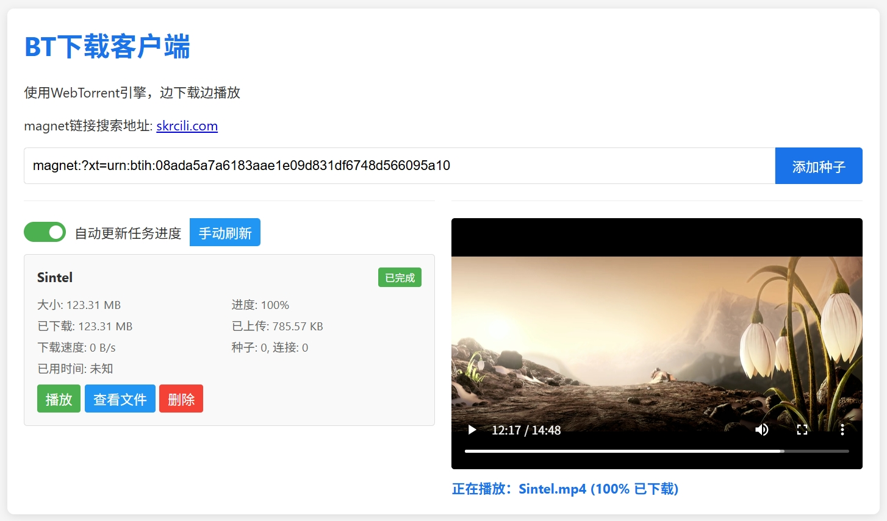

# BitTorrent 下载应用

这是一个基于Node.js和WebTorrent的BitTorrent下载和流媒体应用。它允许用户通过磁力链接下载BitTorrent种子，并在浏览器中直接流式播放视频文件。

<p align="center">
  
</p>

## 特性

- 通过磁力链接添加和管理种子
- 支持WebTorrent客户端和标准BitTorrent协议
- HTTP流媒体服务，可直接在浏览器中播放视频
- 数据库持久化存储种子信息
- 文件选择功能，可选择性下载部分文件
- 暂停/恢复下载功能
- 磁盘空间管理
- 完整的日志系统

## 项目结构

```
nodejs/
  ├── app.js                     # 应用入口点
  ├── server.js                  # Express服务器配置
  ├── config/
  │   └── index.js               # 配置文件
  ├── routes/
  │   ├── api-routes.js          # API路由
  │   └── stream-routes.js       # 流媒体路由
  ├── services/                  # 业务服务与核心功能
  │   ├── db-service.js          # 数据库服务
  │   ├── dht-enhancer.js        # DHT功能增强
  │   ├── disk-manager.js        # 磁盘管理
  │   ├── torrent-service.js     # 种子管理服务
  │   └── webtorrent-client.js   # WebTorrent客户端封装
  ├── utils/                     # 工具与通用辅助模块
  │   ├── logger.js              # 日志系统
  │   ├── system-monitor.js      # 系统监控
  │   └── tracker-utils.js       # Tracker工具函数
  ├── prisma/                    # Prisma数据库模型
  │   ├── schema.prisma          # 数据库模型定义
  │   └── migrations/            # 数据库迁移文件
  ├── logs/                      # 日志文件
  └── public/                    # 静态文件
```

## 主要模块功能

### 核心服务

- **app.js**: 应用入口点，负责启动服务器和处理进程信号
- **server.js**: Express服务器配置，包括中间件、路由和错误处理
- **webtorrent-client.js**: WebTorrent客户端的配置和操作封装
- **torrent-service.js**: 种子管理的核心逻辑，包括添加、删除、暂停/恢复种子
- **logger.js**: 日志系统，将日志写入文件和控制台

### 路由

- **api-routes.js**: 提供种子管理相关的API端点
- **stream-routes.js**: 处理流媒体和文件下载相关的路由

### 工具和辅助模块

- **tracker-utils.js**: Tracker相关工具函数，包括获取最新Tracker列表
- **disk-manager.js**: 负责磁盘空间管理，删除文件等操作
- **dht-enhancer.js**: 增强DHT网络功能，提高种子发现效率
- **system-monitor.js**: 监控系统资源和性能

## API端点

### 种子管理

- `POST /api/add`: 添加新的磁力链接
- `GET /api/list`: 获取所有种子列表
- `GET /api/torrents/:infoHash`: 获取单个种子详情
- `DELETE /api/torrent/:infoHash`: 删除种子
- `POST /api/toggle/:infoHash`: 暂停/恢复种子
- `GET /api/files/:infoHash`: 获取种子中的文件列表
- `POST /api/select/:infoHash`: 选择要下载的文件

### 流媒体和下载

- `GET /stream/:infoHash/:fileIndex`: 按索引流式传输文件
- `GET /api/stream/:infoHash/:fileName`: 按文件名流式传输
- `GET /download/:infoHash/:fileIndex`: 下载文件

### 系统和状态

- `GET /health`: 健康检查
- `GET /api/status`: 获取系统状态
- `GET /api/health`: 获取客户端健康状态

## 安装和运行

1. 确保已安装Node.js 16+
2. 安装依赖:
   ```
   npm install
   ```
3. 初始化数据库:
   ```
   npx prisma migrate dev
   ```
4. 启动应用:
   ```
   npm start
   ```

## 环境变量

可以通过环境变量或`.env`文件配置应用:

```
PORT=3000                # 服务器端口
HOST=0.0.0.0             # 服务器主机
DOWNLOAD_PATH=/path/to/downloads  # 下载路径
DATABASE_URL=file:./dev.db        # 数据库URL
MAX_CONNECTIONS=100      # WebTorrent最大连接数
DHT_ENABLED=true         # 启用DHT
DISK_SPACE_LIMIT=10737418240  # 磁盘空间限制(10GB)
LOG_LEVEL=info           # 日志级别
```

## 开发

```
npm run dev
```

## 调试

```
npm run debug
```

## 许可

MIT 